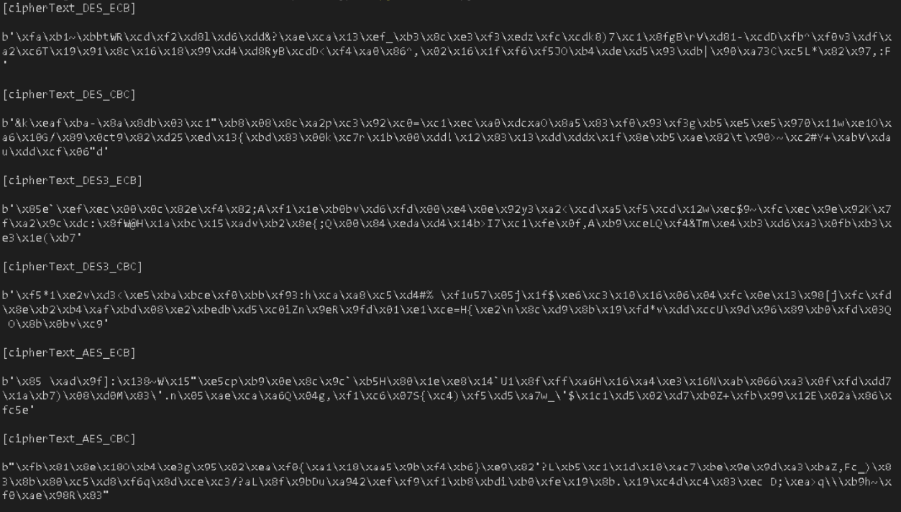
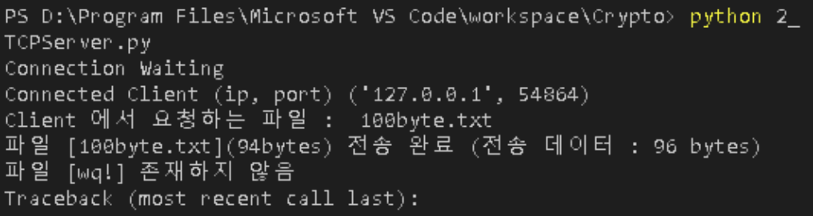
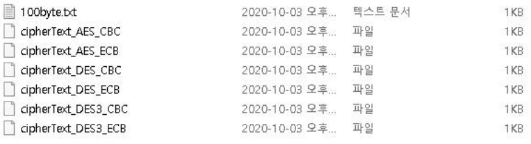
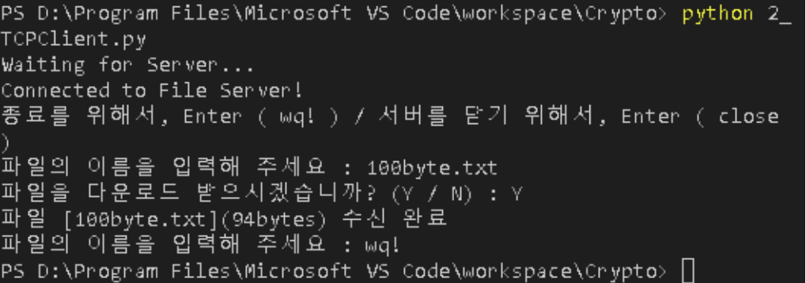
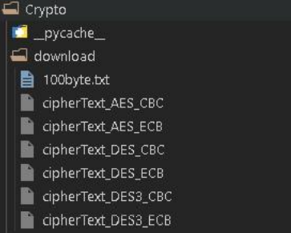

# First Project

### Block 암호법  DES, 3DES, AES 를 프로그래밍 하고 동작을 검증하기

1. 100byte  이상의 text 파일을 대상으로 암호화 하여 저장하고 다시 복호화 하여 확인

2. 파일을 전송하는 단단한 client-server 프로그램을 작성하고 이를 암호화 하여 전송한후 복호화 하여 확인

3. 그림판으로 간단한 도형을 그린후 gif 형식으로 저장한후 이를 ECB, CBC 모드로 암호화한후 암호화된 파일을 보이기

### 환경

* Windows10 - 64bits
* Python3

### 필요 설치 라이브러리

* pycryptodome : for Using Crypto
* pillow : for Using Image

## Block 암호법

각 암호법에 대해 class 를 지정해주었고 해당 class 에는 아래의 methods 가 있다.

해당 객체는 key를 받고 이를 이용해 암호화를 진행하는 역할을 가지고 있다.

* encrypt : byte 형식의 데이터를 받아 block_size에 맞게 데이터 크기를 맞추어 암호화 한 데이터를 반환

* decrypt : byte 형식의 암호화된 데이터를 받아 복호화 하고 증가시킨 데이터를 제거한 데이터를 반환

### 파일들 

* DES
    - ECB : DES_ECB.py
    - CBC : DES_CBC.py
* DES3
    - ECB : DES3_ECB.py
    - CBC : DES3_CBC.py
* AES
    - ECB : AES_ECB.py
    - CBC : AES_CBC.py

## 문제 1

### 100byte 이상의 text 파일

> 1_100byte.py

```
This is an 100 bytes file
Pycryptodome is needed for crypto
This .txt file will be encrypted
```

위의 내용을 암호화하고 저장하였다.

아래는 결과들이다.



### 암호화 된 100byte.txt in 1_result File

* cipherText_DES_ECB
* cipherText_DES_CBC
* cipherText_DES3_ECB
* cipherText_DES3_CBC
* cipherText_AES_ECB
* cipherText_AES_CBC

## 문제 2

### Server

> 2_TCPServer.py

1. Client 와 통신대기 (연결이 될 때 까지)
2. Client에게서 처음 받은 데이터를 복호화 (파일 이름)
3. 파일 이름에 해당하는 파일이 있으면 “ready”, 없으면 “N”을 암호화 후 Client에게 전송
4. Client에게서 두 번째로 받은 데이터를 복호화 (“Y”라면 파일 전송을, 나머지는 파일 전송 X)
5. 파일을 1KB 씩 암호화하여 연속 전송 (마지막은 0bit 로 마지막 임을 전송)
6. 2 ~ 5 반복

### Client

> 2_TCPClient.py

1. Server 와 통신대기
2. Server에게 받고 싶은 파일 이름을 암호화한 뒤 전송
3. 파일이 있다면, 다운로드 여부를 ‘Y’ / ‘N’ 으로 암호화 하여 전송
    - 데이터를 받아 복호화 후 파일 이름에 해당하는 파일이 있으면 “ready”, 없으면 “N”
4. Server 에게 1byte 씩 받아 복호화 후 같은 파일 이름으로 데이터를 저장
5. 2 ~ 4 반복

**download 라는 폴더가 생성되어 있어야 함**

### Server Result

실행 결과



서버파일




#### Client Result

실행 결과



download 폴더




## 문제 3

### 그림판으로 만든 bmp 파일

> image.bmp


### Program

> 3_bmpReader.py

1. 이미지 파일(BMP)를 PIL.Image(PILLOW)를 이용해 RGB 데이터를 가져오기
2. RGB 데이터를 Image.tobytes() 함수를 이용하여 byte 데이터 변경
3. 이 데이터를 각각 ECB, CBC 방식으로 암호화
4. 암호화 된 데이터를 가시화하여 보기 위해 Image.frombytes(mode, size, data)를 통해 RGB 데이터로 변경
5. RGB 데이터를 각 이름에 맞는 BMP 이미지 파일로 저장

### ECB Result

encrypted_image_DES_ECB.BMP


encrypted_image_DES3_ECB.BMP


encrypted_image_AES_ECB.BMP


### CBC Result

encrypted_image_DES_CBC.BMP


encrypted_image_DES3_CBC.BMP


encrypted_image_AES_CBC.BMP


