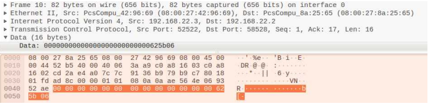
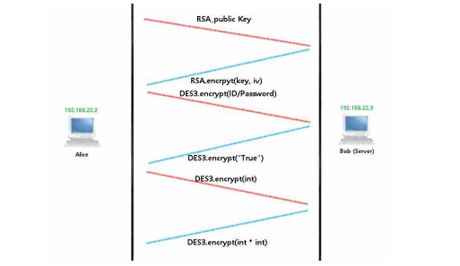

# Second Project

Server - Client 간의 통신에서의 Trudy 공격 및 방어 방법

* Trudy 가 사용자 정보를 획득할 수 있는 방법을 제시하라.
* Trudy 가 어떤 값을 입력했는지 알 수 있는 방법을 보여라.
* 위의 결과를 보고 보안상 문제점과 개선방법을 설명하라.

### 환경

* Oracle VM VirtualBox / Ubuntu - 64bits
* Vyos (Router)
* Python3

### 필요 설치 라이브러리

* sudo –H pip3 install —ignore-installed scapy
* sudo ifconfig enp0s8 promisc
* sudo –H pip3 install pyopenssl

### 임시 네트워크 구성도

## Adversarial Program 1

### Server

> Adversarial_Program_1/TCPServer.py

* 사용자 정보를 pw 파일에 보관하고 ID와 Password로 인증한다.
* Client에게서 하나의 정수를 입력받아 제곱 값을 Client로 전송한다.

### Client

> Adversarial_Program_1/TCPClient.py

* 연결이 됐을 때 ID / Password를 이용해 인증을 요구한다.
* Server에게 하나의 정수를 전송하고 제곱 값을 Server에게서 받는다.

### Communication Review

#### Sniffing

> Adversarial_Program_1/sniffSide.py

- Trudy가 Alice, Bob의 ip주소를 알아내고 ARP Redirect를 통해 정보를 Sniff 할 수 있다.
- 중간자 공격을 한 Trudy는 TCP통신의 body 데이터를 확인할 수 있다.
- 개선방법
    * Trudy가 알아볼 수 없게 암호화를 하여 데이터를 전송한다.

아래는 Alice와 Bob의 통신을 통해 아이디와 비번을 알아내는 결과이다.

#### Server TCP reaction

- Alice가 Server에 TCP 통신을 하려할 때 Trudy가 Bob(Server)이라고 거짓 정보를 날려 아이디와 패스워드를 받아낼 수 있다.
- 아무런 암호를 걸지 않았으므로 정보를 얻어낼 수 있다.
- 개선방법
    * Alice와 Bob의 통신에서 서로를 인증할 수 있는 방법이 필요하다.

**해당 구현은 Sniffing과 비슷한 것이 많아서 생략했다**

#### Bob's pw File

- Trudy가 Bob의 pw 파일만 얻어낼 수 있으면 Alice의 인증을 할 수 있다. (아무런 암호를 걸지 않았으므로 정보를 얻어낼 수 있다.)
- 개선방법
    * pw 파일에 대해 암호화를 하거나 이를 아무도 건드릴 수 없게 만드는 방법이 있다.

**해당 구현은 운영체제에 대한 해킹이라서 구현하지 못했다.**

#### Brute Force

- Trudy가 Server에 접속해 Alice의 ID와 Password를 무작위 대입을 통하여 모든 값을 비교해 볼 수 있다.
- 개선방법
    * Server에서 일정 횟수 이상의 인증 시도를 실패한다면 연결을 끊거나 차단하는 방식을 사
용할 수 있다.

**해당 구현을 하여도 ID/Password에 길이 제한이 없으므로 엄청난 시간이 걸릴 것으로 예상되어 생략했다.**

## Adversarial Program 2

대칭키 인증 암호화를 통한 통신

> Adversarial_Program_2/DES3_CBC.py

- 대칭키 인증 암호화를 위해 사용된 암호화는 DES3, CBC 암호화 방식이다.
- DES3_CBC.py에 암호화를 하는 class로 기능을 구현하고 객체를 만들어 이를 사용하게 하였다. 
- 대칭키 인증 암호화에는 Alice와 Bob만이 Key를 알고 있다고 가정한다.

암호화된 인증 데이터 확인

### Server

> Adversarial_Program_2/TCPServer.py

### Client

> Adversarial_Program_2/TCPClient.py

### Communication Review

#### Server TCP reaction

#### Bob's pw File

#### Brute Force

**모두 Adversarial_Program_1 과 동일하다**

## Adversarial_Program_3

Diffie-Hellman Key 교환 방법

> Adversarial_Program_3/Diffie_Hellman.py

- 인증과정과 통신내용을 암호화 하도록 프로그램을 개선
- 공개키를 통신으로 공유하고 Diffie-Hellman을 통해 key를 알아낸 뒤 이를 이용해 암호화를 하는 방식으로 구성
- Diffie_Hellman.py에서 diffieHellman 클래스를 구현하여 객체를 만들어 사용하도록 하였다.
-  공동키를 p = 9876437, g = 19576을 사용하였다.

### Server

> Adversarial_Program_3/TCPServer.py

임의의 정수를 1234로 사용하였다.

### Client

> Adversarial_Program_3/TCPClient.py

임의의 정수를 4321로 사용하였다.

### Communication Review

- Server TCP 반응 복사, Sniffing의 해킹 기법으로는 비밀번호를 알아내기 힘들다.
    * (임의의 정수를 통해 공개키를 공유하고 이를 암호화 키에 사용하기 때문이다.)
- 하지만 여전히 Trudy가 공격할 수 있는 여지는 있다.

#### Bob's pw File

#### Brute Force

**Adversarial_Program_1 과 동일하다**

#### Find Diffie-Hellman Key

- Trudy가 Alice와 Bob사이의 첫 통신 숫자를 통해 Key를 알아내는 방법이 있다.
- 이는 많은 경우의 수를 가지고 있으므로 사실상 쉽지 않으나 Alice와 Bob이 안전하지 못한 난수 생성 알고리즘을 가지고 있거나 가능성은 있다.
- 개선방법
    * 개인 Key에 대한 갱신을 자주 하거나 p가 최소 300자리의 소수, 임의의 정수가 100자리 이상의 정수일 경우 많은 경우의 수 때문에 뚫기 힘들 것이다. 

#### man in the middle attack

-  Trudy가 중간에서 통신을 가로채 Alice와 Trudy의 키 교환, Trudy와 Bob의 키 교환으로 두 개의 Deffie-Hellman을 형성하고 Alice와 Bob이 서로 통신하는 것처럼 위장하여 값을 알아낼 수 있다.
- 개선방법
    * Alice와 Bob이 상대방에 대한 인증을 하여야 한다.

## Adversarial_Program_4

RSA Key 교환 방법

- RSA는 공개키 암호 시스템으로 대칭키보다 속도가 느리므로 주로 적은 양의 데이터나 전자서명에 사용한다.
- 통신을 시작하기 전 RSA의 공개키를 받고 이를 통해 대칭키의 Key와 IV를 주고받아 통신을 시작하는 방식을 사용한다.

Public key 수신 후 Key와 IV 공유

1. 통신이 가능한지에 대한 TCP 통신
2. Public Key를 전송하는 TCP 통신
3. Public Key로 암호화된 Key를 전송
4. Public Key로 암호화된 IV를 전송

### Server

> Adversarial_Program_4/TCPServer.py

1. 해당 통신에 대한 RSA Public key를 받는다.
2. Public key를 통하여 대칭키의 Key와 IV를 랜덤 생성하여 이를 보관하고 암호화하여 전달한다.
3. 대칭키 암호화 방식을 통하여 통신을 시작한다.
4. 인증 실패 가능 횟수를 5번으로 지정하여 Brute Force를 방지한다.

### Client

> Adversarial_Program_4/TCPClient.py

1. 첫 통신에서 RSA Public key를 송신한다.
2. 암호화된 Key와 IV를 전달받아 Private key로 복호화하여 이를 통해 대칭키 암호화 방식을 사용한다.
3. 통신을 시작한다.

비밀번호 5회 실패 시

### Communication Review

-   Server TCP / Alice 반응 복사(랜덤 Public Key, 랜덤 DES3 Key, 랜덤 IV 때문),
    Sniffing의 해킹 기법(Public Key로 암호화된 Key와 IV로 DES3 통신 때문),
    Brute Force(Server에서 인증 실패 가능 횟수를 5회로 제한하였기 때문)
    으로는 비밀번호를 알아내기 힘들다.
- 하지만 여전히 Trudy가 공격할 수 있는 여지는 있다.

#### Bob's pw File

- Trudy가 Bob의 pw 파일만 얻어내어서 Alice의 인증을 처음부터 Bob(Server)와 통신하여 인증 할 수 있다.
- 개선방법
    * pw 파일에 대해 암호화를 하거나 이를 아무도 건드릴 수 없게 만드는 방법이 있다.

#### Brute Force(RSA Key)

- Trudy가 Alice와 Bob사이의 첫 통신부터 Public Key를 알고 있고, 그 후에 이루어지는 인증에 대한 값을 Sniff할 수 있다.
- 이를 통해 Trudy가 ID / Password 에 대한 많은 경우의 수를 대입하고 Public Key로 암호화 한 뒤 Sniff한 인증 통신과 비교하여 Brute Force 공격을 시도할 수 있다.
- 이는 많은 경우의 수를 가지고 있으므로 사실상 쉽지 않다.
    * (암호화에도 시간이 많이 걸리기 때문)
- 개선방법
    * ID 와 Password 에 대해서 최소 10자리 이상의 자리수를 정해 시간을 많이 걸리게 한다. 

#### man in the middle attack

- Trudy가 중간에서 통신을 가로채 Alice와 Trudy의 Key 교환, Trudy와 Bob의 Key 교환으로 두 개의 DES3 Key, IV 암호화 방식을 형성하고 Alice와 Bob이 서로 통신하는 것처럼 위장하여 값을 알아낼 수 있다.
- 개선방법
    * Alice와 Bob이 상대방이 보낸 데이터에 대한 인증을 할 수 있으면 된다.

## Adversarial_Program_5

openSSL : Client-Server 간의 통신 내용을 안전하게 보호하는 방법이다

**Server만의 Key 배포**

> Adversarial_Program_5/generateKey.py

인증(sign)을 통하여 상대방이 맞는지 확인하는 절차를 가질 수 있다.

중앙기관인 CA의 인증서를 이용해서 인증할 수 있지만, 실제로 구현하기 어려움이 있으므로 Bob(Server)의 인증서는 CA에 의해서 배포되어 있다고 가정한다.

(server_public.pem 파일에 이를 저장하고 이는 배포 되어있다고 가정한다.)

**Alice와 Bob의 통신의 인증 및 암호화 진행에 대한 TCP들**

Trudy가 다른 Server 인증으로 연결을 시도할 때

### Server

> Adversarial_Program_5/TCPServer.py

1. Client와 Socket 연결이 된다면 Client의 RSA Public Key를 수신을 기다린다.
2. RSA Public Key가 수신되면 이를 저장하고 Server의 Private Key로 sign한 정보를 Client 에게 넘긴다.
3. Client가 sign 된 자신의 Public Key를 Server가 보냈음을 확인한 수신호를 받은 후 DES3 Key를 랜덤 생성하고 이를 Client의 RSA Public Key로 암호화하여 전송한다.
4. 또한 위의 암호화된 DES3 Key를 Server의 Private Key로 sign하여 Client에게 넘긴다.
5. Client가 DES3 Key를 수신했고 이를 Server가 보냈음을 확인한 수신호를 받은 후 DES3 IV를 랜덤으로 생성하고 이를 Client의 RSA Public Key로 암호화 하여 전송한다.
6. 또한 위의 암호화된 DES3 IV를 Server의 Private Key로 sign하여 Client에게 넘긴다.
7. Client가 DES3 IV를 수신했고 이를 Server가 보냈음을 확인한 수신호를 받은 후 DES3 암호화로 ID/Password를 받아 인증을 한다.
8. 암호화된 정수를 받아 제곱수를 암호화해 Client에게 전송한다

### Client

> Adversarial_Program_5/TCPClient.py

1. Server와 Socket 연결이 된다면 Client의 RSA Public Key를 송신하고 sign 된 정보를 기다린다.
2. Server에서 sign된 Public Key를 수신 받으면 이 데이터가 Server의 것인지 확인하고 수신호를 보낸다.
3. RSA Public Key로 암호화된 DES3 Key를 수신 받고 이를 sign한 데이터와 비교하여 Server가 보냈음을 수신호로 알린다.
4. RSA Public Key로 암호화된 DES3 IV를 수신 받고 이를 sign한 데이터와 비교하여 Server가 보냈음을 수신호로 알린다.
5. Server와의 인증이 완료되었다면 DES3 암호화로 ID / Password를 전송한다.
6. 인증이 완료되면 정수를 암호화하여 전송하고 수신 받은 제곱수를 복호화하여 확인한다.

### Communication Review

Server TCP / Alice 반응 복사(Server인증, 랜덤 Public Key, 랜덤 DES3 Key, 랜덤 IV 때문), 

Sniffing의 해킹 기법(Public Key / OpenSSL로 암호화/인증된 Key와 IV로 DES3 통신 때문), 

Brute Force(Server에서 인증 실패 가능 횟수를 5회로 제한하였기 때문), 

RSA의 Key를 통해 Brute Force (통신에 대한 인증을 진행하기에 Alice와 Bob 사이의 통신만 진행이 가능하기 때문), 

중간자 공격 (Bob의 인증이 되지 않는 순간 Alice가 통신을 끊어버리기 때문 & 통신 사이를 가로채더라도 암호화 방법을 뚫을 수 있는 것은 어렵다)

으로는 비밀번호를 알아내기 힘들다.

- 하지만 여전히 Trudy가 공격할 수 있는 여지는 있다.

#### Bob의 pw 파일

#### Side Channel Attack

- Alice가 Bob에게 인증을 할 때 암호체계에서 물리적으로 구현될 때 소요되는 시간, 소비하는 전력, 방출하는 전자기파, 소리 등을 분석하여 추가적인 정보를 얻을 수 있는 공격
- 많은 부가요소에서 이를 파악해 정보를 알아낼 수 있으며 치명적이다.
- 개선방법 : 인증에 있어서 시간을 유지 등의 부가요소를 통해 정보를 얻는 것을 방해하는 방법을 찾아볼 수 있다.

#### Bob의 인증을 Trudy가 가진다면

- Bob이 CA를 통해 인증서를 발급한다고 가정했지만 언제까지나 CA가 안전하다는 가정하에서이다.
- CA가 안전하지 않거나 Bob의 인증서가 시간이 오래돼서 Trudy가 sign 할 수 있는 가능성이 생긴다면 위험해진다.
- 개선방법
    * CA의 신뢰, 보안성이 필요하고 Bob의 인증서에 대한 갱신 등의 노력이 필요할 것이다.

#### OpenSSL의 HeartBleed

- OpenSSL 1.0.1 버전에서 발견된 취약점이다.
- OpenSSL을 구성하고 있는 TLS/DTLS의 HeartBeat 확장 규격에서 발견된 취약점으로 정보가 유출될 수 있다.
- OpenSSL통신을 할 때 Trudy가 클라이언트의 정보의 길이를 속여 거짓 정보를 서버에 전달하면 서버가 내용을 검증하지 않은 채 그 크기에 맞는 정보를 응답하려 할 것이다.
- 이 때 시스템 메모리에 저장되어 있는 작은 정보들을 지속적으로 유출 당할 수 있다.
- 개선방법
    * 서버에서는 정보 요청에 대해서 Heartbeat를 사용하지 않도록 컴파일 옵션을 설정하거나 
내용을 검증하면서 그 정보에 응답을 하는 방법이 있다.
- OpenSSL 버전을 업데이트 해서 사용한다.

## Review

암호화 / 인증 방식의 취약점 과 pw 파일 보안에 대해서는 추가적으로 조치가 필요할 것이다.

### 대칭키를 이용한 사용자 인증 과정 암호화

### Diffie-Hellman Key 교환 방법으로 인증 과정 & 통신 내용 암호화

### RSA 방식을 활용하여 개선

### OpenSSL을 활용하여 개선

